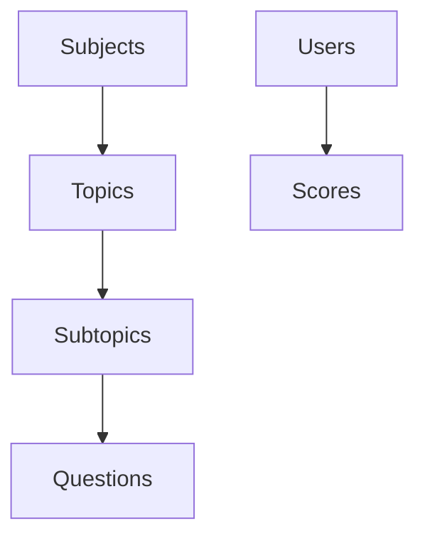

# Lexolingo API

The Lexolingo API provides programmatic access to quiz content, user scores, and application settings. This documentation covers all available endpoints and how to use them.

## API Base URL

All API endpoints are relative to the base URL:

```
https://api.lexolingo.com/v1
```

For local development, the base URL is:

```
http://localhost:3000/api/v1
```

## Data Structure

The Lexolingo API follows the hierarchical structure of the application:



## Authentication

All API endpoints are authenticated using Bearer tokens.

```bash
curl -X GET \
  https://api.lexolingo.com/v1/subjects \
  -H 'Authorization: Bearer YOUR_API_KEY'
```

## Response Format

All API responses are returned in JSON format and include a standard structure:

```json
{
  "success": true,
  "data": { },
  "error": null
}
```

In case of an error:

```json
{
  "success": false,
  "data": null,
  "error": {
    "code": "NOT_FOUND",
    "message": "The requested resource was not found"
  }
}
```

## Rate Limiting

The API implements rate limiting to ensure fair usage. Current limits are:

- 100 requests per minute for authenticated users
- 20 requests per minute for unauthenticated users
