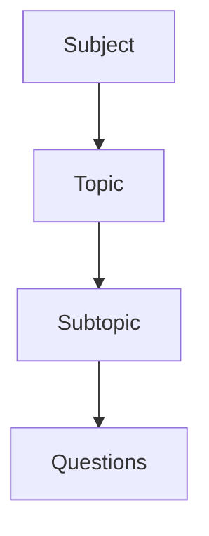

# Quiz Structure

Lexolingo uses a hierarchical data structure to organize quiz content, making it easy to navigate and manage your quiz material.

## Hierarchical Organization

The quiz content in Lexolingo is organized in a four-level hierarchy:

### Subjects

Subjects are the top-level categories in Lexolingo. For example, in a Star Wars-themed quiz app, subjects might include:

- Characters
- Planets
- Vehicles
- Movies
- TV Shows

### Topics

Topics are subcategories within a subject. For example, within the "Movies" subject, topics might include:

- Original Trilogy
- Prequel Trilogy
- Sequel Trilogy
- Standalone Films

### Subtopics

Subtopics provide further categorization within topics. For example, within the "Original Trilogy" topic, subtopics might include:

- A New Hope
- The Empire Strikes Back
- Return of the Jedi

### Questions

Questions are the actual quiz content that users will answer. Each question belongs to a specific subtopic and includes:

- Question text
- Multiple-choice options
- Correct answer
- Optional explanation

## Database Storage

All quiz content is stored in and retrieved from a backend database, ensuring data persistence and efficient access. The database schema is designed to support this hierarchical structure while maintaining optimal query performance.

## Navigation

Users can navigate through this hierarchy to find specific questions or take quizzes on particular subjects, topics, or subtopics of interest.
